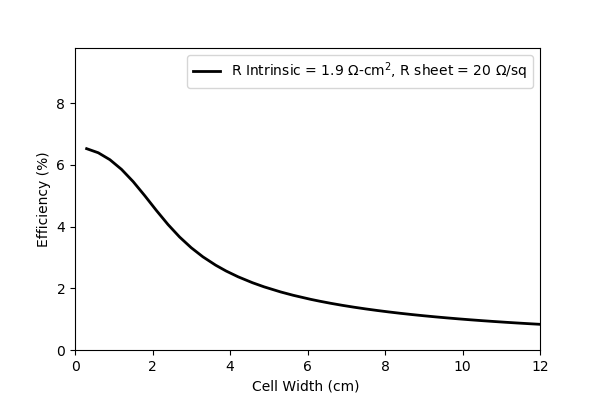
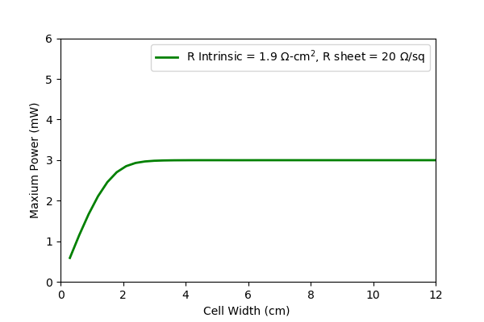
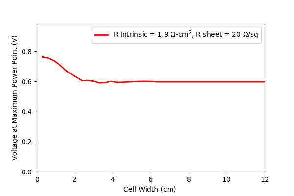
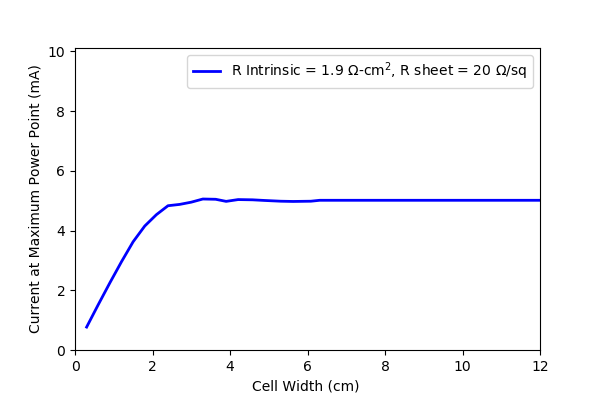

# SolarCellEff_vs_CellWidth
Simulating efficiency of a solar cell as a function of cell width accounting for sheet resistance

Simulation in Python. Main packages required: math, numpy, scipy and matplotlib.

Should run Internal_SolarCell_Resistance-1D first before this.

-----
The cell is discretized into multiple cells in series.

-----

-----

-----

-----

